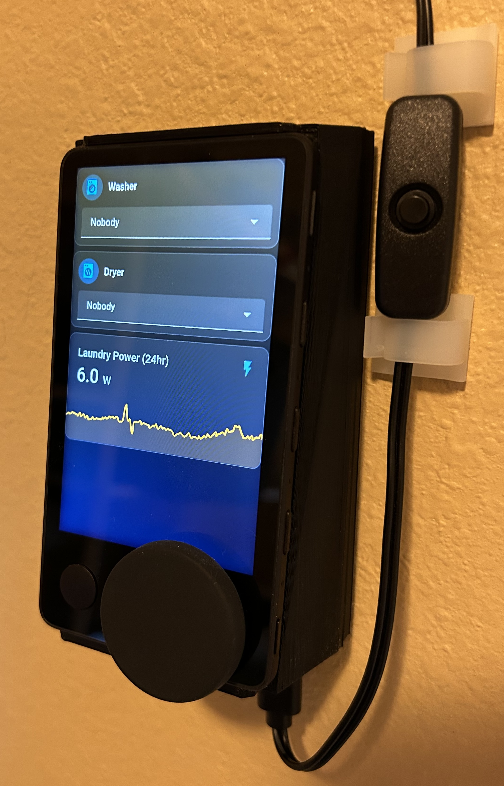
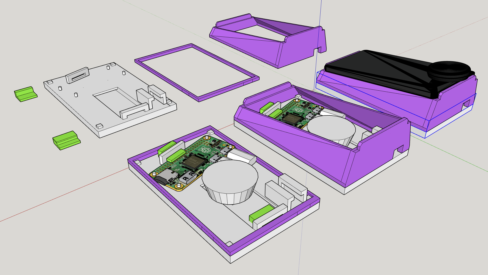
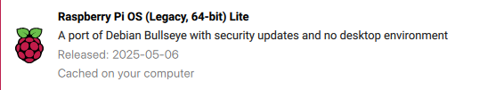
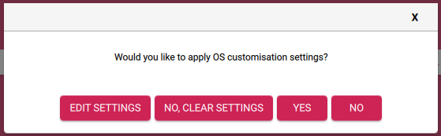
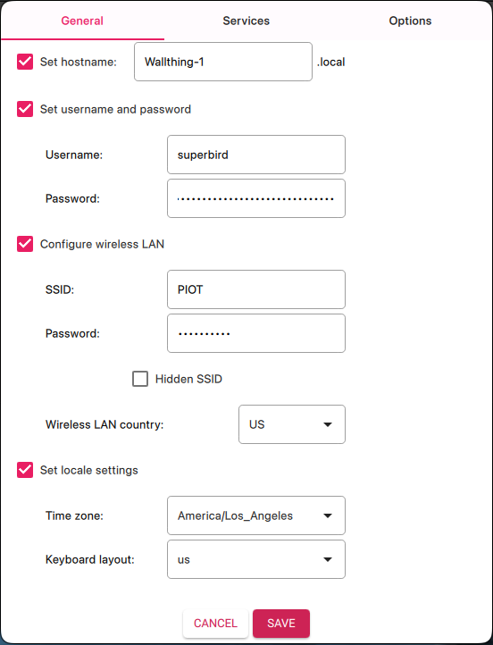

# Wall Thing: Debian Chromium Kiosk on Spotify Car Thing (superbird)

This is a prebuilt image of Debian 11 (Bullseye) for the Spotify Car Thing, aka superbird.
It combines the stock kernel with a debian rootfs, and launches a fullscreen Chromium kiosk. I like to use it with Home Assistant.




This image will remove the default Spotify functionality. You should definitely [make a full backup](https://github.com/bishopdynamics/superbird-tool) before proceeding!

Default user and password are both `superbird`


[Releases](https://github.com/bishopdynamics/superbird-debian-kiosk/releases)

## 3D Printed Case

The case in the pictures [can be found in here](./Wallthing/).


## Features

Working:

- Debian 11 (Bullseye) aarch64
- Framebuffer display working with X11, in portrait or landscape, with touch input
- Networking via USB RNDIS (requires a host device)
- Automatic blacklight on/off with display wake/sleep
- VNC and SSH (forwarded through host device)
- Chromium browser, fullscreen kiosk mode
- Buttons and dial used to control a light and recall scenes/automations/scripts on Home Assistant
- 256MB `settings` partition used for Chromium user profile

Available, but not used in this image:

- Bluetooth
- Backlight brightness control (currently fixed at 100)
- Audio (mic array, DSP)

Not working:

- Wifi
- GPU acceleration

WiFi is technically possible on this hardware, but the stock bootloaders and kernel disable it.
It might be possible to cherry-pick the wifi information from the Radxa Zero device tree (practically the same SoC), but I think you would need to rebuild one or more of the bootloader stages to make it work.

GPU: the hardware has a Mali GPU, but the stock OS uses it via DirectFB QT library, and does not include necessary libraries to make it work with X11. It may be possible to grab the needed files from Radxa Zero.

## Boot Modes

After installation, you will have 3 different boot options, depending on what buttons are held:

- Debian Mode - default, no buttons held

  - bootlogo is blue Home Assistant icon
  - kernel is `boot_a` root is `data`

- Utility Mode - hold button 1

  - bootlogo says Utility Mode
  - kernel is `boot_a` root is `system_a`
  - adb and already configured
  - scripts to install debian

- USB Burn Mode - hold button 4
  - bootlogo says USB Burn Mode

## Installation

### Requirements

- Spotify Car Thing
- a Raspberry Pi Zero 2 W
  - update: highly recommend using Raspberry Pi Zero 2 W
  - I no longer recommend any Radxa sbcs, as they have issues and many are abandoned by Radxa and/or Armbian
- a MicroUSB -> USB-C cable to connect the two
- power supply for the host device
- a desktop/laptop for flashing the image to the Car Thing

### Setup

NOTE: you MUST set user name to `superbird` in customization settings. The setup [scripts here](./image_config.sh) assume this username.

1. Download and extract the latest image from [Releases](https://github.com/bishopdynamics/superbird-debian-kiosk/releases)
2. Put your device in burn mode by holding buttons 1 & 4 while plugging into usb port
   1. avoid using a USB hub, you will have issues flashing the image
3. Use the latest version of [superbird-tool](https://github.com/bishopdynamics/superbird-tool) to flash the extracted image folder:

```bash
# root may be needed, check superbird-tool readme for platform-specific usage
# make sure your device is found
python3 superbird_tool.py --find_device
# restore the entire folder to your device
python3 superbird_tool.py --restore_device ~/Downloads/debian_v1.2_2023-12-19
```

4. Configure a host system

   1. Flash microsd using Raspbery Pi Imager:

   

   2. NOTE: you MUST set user name to `superbird` in customization settings. The setup [scripts here](./image_config.sh) assume this username.

   
   

   3. insert microsd into the host device and power it on (without Car Thing)
   4. copy/paste [`prep_host.sh`](./prep_host.sh) to the host
   5. run `prep_host.sh` as root
      ```
      sudo bash prep_host.sh
      ```
   6. run `setup_host.sh` as root, and reboot
      ```bash
      cd superbird-debian-kiosk
      sudo bash setup_host.sh
      sudo reboot
      ```
   7. Connect the Car Thing into the host device and power it up

5. ssh to the host device, and then you should be able to ssh to the Car Thing (user and password are both `superbird`, but an ssh key should be pre-installed so the password is not required) :

```bash
# the script added an entry in /etc/hosts, use hostname "superbird" from host device
ssh superbird@superbird
# or by ip (host device is 192.168.7.1, superbird is 192.168.7.2)
ssh superbird@192.168.7.2
```

1. From another device on the same network, you should be able to ssh directly to the Car Thing using port 2022:

```bash
# where "host-device" is the hostname or ip of your host device
ssh -p 2022 superbird@host-device
```

1. Once you have ssh access to the Car Thing, edit some things:
   1. Probably change password
   2. Edit `/scripts/browser_settings.sh` to change what URL to launch in the kiosk
      1. Restart X11 and Chromium with: `sudo systemctl restart browser.service`
   3. Edit `/scripts/buttons_settings.py` to change Home Assistant URL and add long-lived token for access
      1. assign scenes/automations/scripts to buttons, assign a light entity to the knob
      2. Restart buttons script with: `sudo systemctl restart buttons.service`
   4. Edit `/etc/X11/xorg.conf` to adjust screen timeout (default 0), orientation (default portrait)
      1. for landscape, un-comment lines `38` and `71`
   5. Edit `/scripts/setup_display.sh` and `/scripts/setup_backlight.sh` to adjust backlight brightness (default 100)
      1. Restart backlight script with: `sudo systemctl restart backlight.service`
   6. Change vnc password: `sudo vncpasswd /scripts/vnc_passwd`
      1. Restart vnc server with: `sudo systemctl restart vnc.service`
2. Using your favorite VNC client, connect by VNC to the host device's address, port 5900, if you need to interact with a page (sign in)
3. ?
4. Profit

### Final steps:

once you have the raspberry pi configured correctly, I recommend enabling overlay mode and putting root filesystem as read-only.
With this, any changes you make on the raspberry pi will be lost after a reboot, however this also prevents sdcard corruption from power loss.

```bash
sudo raspi-config
```

1. Select "Performance Options" -> "Overlay File System"
2. answer yes when asked to enable overlay filesystem, and again when asked to make root filesystem read-only
3. reboot

## How to build the image

The release build script runs the image build script twice, once for each orientation, and using local proxy.

```bash
./build_release.sh
```

The image build script takes two flags:

```bash
./build_image.sh [--local_proxy] [landscape|portrait]
```

examples:

```bash
- ./build_image.sh  # portrait screen, do not use local caching proxy
- ./build_image.sh --local_proxy  # portrait screen, use local caching proxy
- ./build_image.sh landscape --local_proxy  # landscape screen, use local caching proxy)
```

1. using [superbird-tool](https://github.com/bishopdynamics/superbird-tool), use `--dump_device` to dump a stock device into `./dumps/debian_current/`
2. install apt-cacher-ng: `sudo apt install apt-cacher-ng`
3. run `./build_image.sh --local_proxy landscape`, which will:
   1. replace `env.txt` with switchable version (see [`files/env/env_switchable.txt`](files/env/env_switchable.txt))
   2. modify `system_a` partition for Utility Mode:
      1. install usb gadget for ADB (see [`files/system_a/etc/init.d/S49usbgadget`](files/system_a/etc/init.d/S49usbgadget))
      2. modify `/etc/fstab` and `/etc/inittab` to not mount `data` or `settings` partitions (see [`files/system_a/etc/`](files/system_a/etc))
   3. format `settings` partition
   4. format `data` partition, and:
      1. use debootstrap to create a minimal debian root filesystem, plus a few extra packages
         1. `systemd systemd-sysv dbus kmod usbutils htop nano tree file less locales sudo dialog apt wget curl iputils-ping iputils-tracepath iputils-arping iproute2 net-tools openssh-server ntp xserver-xorg-core xserver-xorg-video-fbdev xterm xinit x11-xserver-utils shared-mime-info xserver-xorg-input-evdev libinput-bin xserver-xorg-input-libinput xinput fbset x11vnc chromium python3-minimal python3-pip`
         2. python packages from [`requirements.txt`](files/data/scripts/requirements.txt)
      2. copy `/lib/modules/4.9.113` from `system_a`
      3. configure X11 via [`/etc/X11/xorg.conf`](files/data/etc/X11/xorg.conf.portrait)
      4. set hostname to `superbird` (configure in [`image_config.sh`](image_config.sh))
      5. add entry to `/etc/hosts` to resolve `host` as `192.168.7.1` (host device)
      6. create regular user `superbird`, password: `superbird`, with passwordless sudo (configure in [`image_config.sh`](image_config.sh))
      7. install scripts to `/scripts/` (see [`files/data/scripts/`](files/data/scripts))
      8. install services to `/lib/systemd/system/` (see [`files/data/lib/systemd/system/`](files/data/lib/systemd/system))
      9. set locale to `en_US.UTF-8`
      10. set timezone to `America/Los_Angeles`
      11. add entry to `/etc/fstab` to mount `settings` partition at `/config` (for browser profile) (see [`files/data/etc/fstab`](files/data/etc/fstab))
      12. add entry to `/etc/inittab` to enable serial console at 115200 baud (see [`files/data/etc/inittab`](files/data/etc/inittab))
      13. generate new image for `logo` partition using [`files/logo/*.bmp`](files/logo)
4. You now have an image at `./dumps/debian_current/` ready to flash to device using [superbird-tool](https://github.com/bishopdynamics/superbird-tool)

Hint: Install `apt-cacher-ng` and then run `./build_image.sh --local_proxy` to use locally cached packages (avoid re-downloading packages every time, much faster)

## Warranty and Liability

None. You definitely can mess up your device in ways that are difficult to recover. I cannot promise a bug in this script will not brick your device.
By using this tool, you accept responsibility for the outcome.

I highly recommend connecting to the UART console, [frederic's repo](https://github.com/frederic/superbird-bulkcmd) has some good pictures showing where the pads are.

Make backups.
